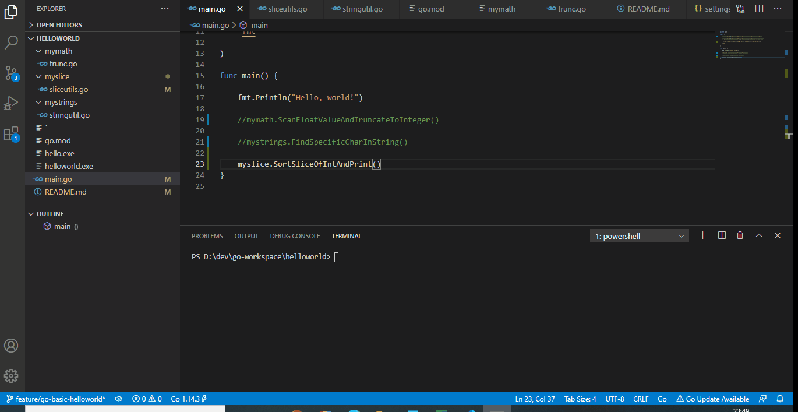

# go-basics-examples
This is a "Go" basic programming examples.

###  go version go1.14.3 windows/amd64

### VS Code version 1.52.1

## Project solves below assignments

1. Write a program which prompts the user to enter a floating point number and
	prints the integer which is a truncated version of the floating point number that was entered.

   #### Demo
   

2. Write a program which prompts the user to enter a string. 
   The program searches through the entered string for the characters ‘i’, ‘a’, and ‘n’. 
   The program should print “Found!” if the entered string starts with the character ‘i’, 
   ends with the character ‘n’, and contains the character ‘a’. The program should print “Not Found!” otherwise. 
   The program should not be case-sensitive, so it does not matter if the characters are upper-case or lower-case.

   ## Demo
    
   
   
3. Write a program which prompts the user to enter integers and stores the integers in a sorted slice.
   The program should be written as a loop. Before entering the loop, the program should create an empty integer slice of size (length) 3.
   During each pass through the loop, the program prompts the user to enter an integer to be added to the slice.
   The program adds the integer to the slice, sorts the slice, and prints the contents of the slice in sorted order.
   The slice must grow in size to accommodate any number of integers which the user decides to enter.
   The program should only quit (exiting the loop) when the user enters the character ‘X’ instead of an integer.

   ## Demo
   

### running the app
go run main.go

